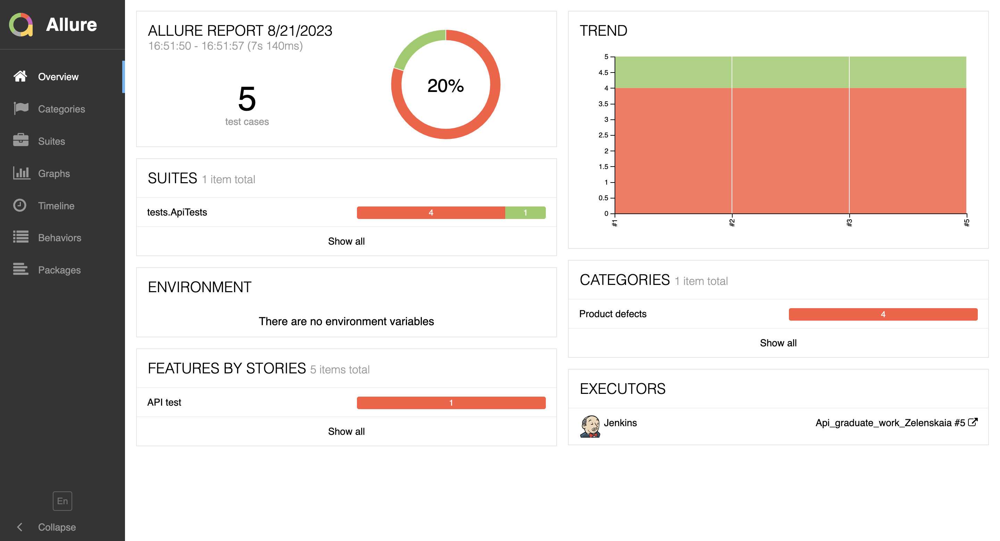

<h1 >API test automation project for <a href="https://dummy.restapiexample.com/#google_vignette/">dummy.restapiexample.com</a></h1>
<p align="center">
  
</p>
<a name="Ссылка"></a>

- <a href="#tools">Stack of technologies</a>
- <a href="#tests">List of checks</a>
- <a href="#run">Running tests from the terminal</a>
- <a href="#remote">Remote running tests</a>
- <a href="#jenkins-report">Running tests in Jenkins</a>
- <a href="#allure-report">Test results report in Allure Report</a>
- <a href="#allure-testops">Integration with Allure TestOps</a>
- <a href="#jira">Integration with Jira</a>
- <a href="#telegram">Integration with Telegram</a>


<a id="tools"></a>
## :computer: Stack of technologies

| Java                                                                                                    | IntelliJ Idea                                                                                                                | Allure                                                                                                                    | Allure TestOps                                                                                                      | GitHub                                                                                                    | JUnit 5                                                                                                           | Gradle                                                                                                   | REST Assured                                                                                                   |  Jenkins                                                                                                                |
|:--------------------------------------------------------------------------------------------------------|------------------------------------------------------------------------------------------------------------------------------|---------------------------------------------------------------------------------------------------------------------------|---------------------------------------------------------------------------------------------------------------------|-----------------------------------------------------------------------------------------------------------|-------------------------------------------------------------------------------------------------------------------|----------------------------------------------------------------------------------------------------------|----------------------------------------------------------------------------------------------------------------|-------------------------------------------------------------------------------------------------------------------:|------------------------------------------------------------------------------------------------------------------------------|
| <a href="https://www.java.com/"></a> | <a id ="tech" href="https://www.jetbrains.com/idea/"></a> | <a href="https://github.com/allure-framework"></a> | <a href="https://qameta.io/"></a> | <a href="https://github.com/"></a> | <a href="https://junit.org/junit5/"></a> | <a href="https://gradle.org/"></a> | <a href="https://rest-assured.io/"></a>  |   <a href="https://www.jenkins.io/"></a> | <a href="https://www.atlassian.com/ru/software/jira"></a> |
<a id="tests"></a>

## Checks carried out:


- [x] Checking id and username
- [x] Checking user creation
- [x] Checking username change
- [x] User deletion check

<a id="run"></a>
## :computer: Running tests from the terminal
### Remote running tests

```
gradle clean test  
```

<a id="jenkins-report"></a>
##  Running tests in [Jenkins](https://jenkins.autotests.cloud/job/Api_graduate_work_Zelenskaia/)

To pass autotests, you need to click on <code><strong>*Собрать сейчас*</strong></code> 

<p align="center">
  
</p>


<a id="allure-report"></a>
##  Test results report in [Allure Report](https://jenkins.autotests.cloud/job/Api_graduate_work_Zelenskaia/allure/)

<p align="center">
  
</p>

From <code><strong>Jenkins</strong></code> 
With Jenkins, reports are generated in <code><strong>Allure</strong></code>

<p align="center">
  
</p>

<a id="allure-testops"></a>
##  Integration with [Allure TestOps](https://allure.autotests.cloud/launch/28997)

## Test-cases

<p align="center">
  
</p>

<a id="telegram"></a>
##  Telegram notifications using a bot
After passing all the tests, an automatic report is sent to the <code>Telegram</code> messenger

<p align="center">

</p>


[Вернуться к оглавлению ⬆](#Ссылка)
